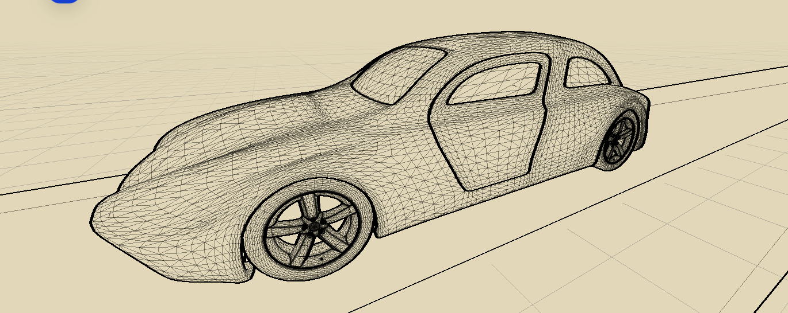

# Визуальные режимы Blueprint и Pencil

Статус: идея зафиксирована, реализацию продолжить после GPU OpenSubdiv.

## Целевой образ

Blueprint и карандашный режим используют одно дизайнерское пространство без гаража:

- тёплый бежевый фон;
- отдельная плоскость под машиной;
- перспективная координатная сетка, плавно исчезающая вдали;
- залитая поверхность машины с настоящей сеткой полигонов поверх неё;
- отдельный экранный фильтр определяет характер изображения: Blueprint либо Pencil.

Референс случайно получился в редакторе Unity как сочетание `Shaded Wireframe`, редакторской сетки и Blueprint-фильтра:

Важная деталь — линии имеют разную визуальную толщину. Wireframe остаётся честным и показывает реальные треугольники, а выразительность создаётся Blueprint/Pencil-фильтром, перспективой и разной плотностью геометрии.

Старый гаражный объект `SCENE`, его свет и `GroundForDeform` в этих режимах скрываются. Для пола нужна отдельная лёгкая плоскость с procedural grid shader, чтобы технический вид не зависел от гаражной сцены.

## Wireframe

### Wireframe Shader (All In One)

https://assetstore.unity.com/packages/vfx/shaders/wireframe-shader-all-in-one-181386

Предпочтительный готовый вариант: входит в Amazing Shaders Bundle и функциональнее минимальных решений.

- Built-in, URP и HDRP;
- заявлены Unity 6 и мобильные платформы;
- исходный код включён;
- толщина, цвет, прозрачность и затухание по расстоянию;
- интеграция с Shader Graph;
- editor/runtime-инструменты подготовки wireframe-данных;
- перед использованием рассчитывает и записывает wireframe-данные в mesh.

Для CarDesign подготовка должна выполняться один раз после создания OpenSubdiv topology. Во время drag должны обновляться только позиции вершин; повторная подготовка wireframe каждый кадр недопустима.

### Wireframe Shader Effect

https://assetstore.unity.com/packages/vfx/shaders/wireframe-shader-effect-199700

Более компактная альтернатива для сравнения.

- URP и Unity 6;
- заявлена работа на Android, iOS, Metal, Vulkan и OpenGL ES;
- автоматически создаёт вспомогательную геометрию для произвольных и runtime-generated meshes;
- пакет значительно меньше;
- перед выбором проверить, может ли runtime-компонент сохранить подготовленную topology и далее обновлять только вершины.

### Собственная реализация

Резервный и наиболее контролируемый путь:

1. OpenSubdiv создаёт итоговую topology и stencil tables один раз.
2. Вместе с GPU-буферами создаются barycentric-данные либо отдельный индексный line buffer.
3. Compute Shader обновляет позиции и нормали при drag.
4. Обычный материал рисует поверхность, второй проход — реальные рёбра.
5. Blueprint/Pencil post-process обрабатывает готовое изображение.

Geometry shader не должен быть основой мобильной реализации: Metal его не поддерживает, а поддержка на мобильном Vulkan/OpenGL ES неоднородна.

## Amazing Shaders Bundle

https://assetstore.unity.com/packages/vfx/shaders/amazing-shaders-bundle-196761

### Lowpoly Shader

Интересен как отдельный творческий или учебный вид — аналог скульптурной обрубовки головы. Поверхность намеренно показывается крупными плоскостями, чтобы лучше читать массу, пропорции и переходы формы.

Возможные применения:

- учебный режим анализа формы;
- временный вид во время редактирования;
- отдельный материал презентации;
- стилизованный экспорт или публикация.

### Advanced Dissolve

Не приоритетная механика, скорее эффект «для удовольствия». Возможное применение: появление машины, смена режима или рекламная презентация — только если эффект не добавляет заметной сложности и веса сборки.

### Dynamic Radial Masks

Потенциально полезен для локальных объёмных световых и reveal-эффектов. Нужно отдельно проверить варианты, пригодные для мобильных устройств без дорогого прозрачного overdraw.

Возможные применения:

- подсветка выбранной части;
- презентация детали или нового материала;
- направленный свет в ночной или шоурумной сцене;
- маска перехода между обычным и техническим видом.

## Порядок работ

1. Завершить GPU OpenSubdiv и получить стабильное обновление vertex buffer при drag.
2. Проверить Wireframe Shader (All In One) на runtime-generated OpenSubdiv mesh.
3. Убедиться, что wireframe topology рассчитывается один раз.
4. Собрать общую сцену Blueprint/Pencil с отдельным процедурным полом.
5. Настроить два профиля обработки камеры поверх одной сцены.
6. Измерить стоимость на Android и iOS.

